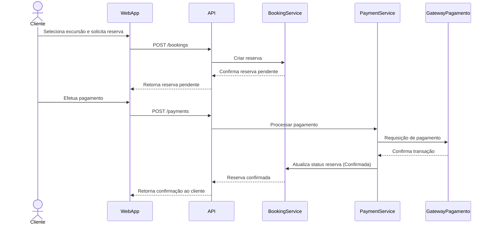

# Diagrama de Sequência – Reserva e Pagamento

```mermaid
sequenceDiagram
    actor Cliente
    participant WebApp
    participant API
    participant BookingService
    participant PaymentService
    participant GatewayPagamento

    Cliente->>WebApp: Seleciona excursão e solicita reserva
    WebApp->>API: POST /bookings
    API->>BookingService: Criar reserva
    BookingService-->>API: Confirma reserva pendente
    API-->>WebApp: Retorna reserva pendente

    Cliente->>WebApp: Efetua pagamento
    WebApp->>API: POST /payments
    API->>PaymentService: Processar pagamento
    PaymentService->>GatewayPagamento: Requisição de pagamento
    GatewayPagamento-->>PaymentService: Confirma transação
    PaymentService->>BookingService: Atualiza status reserva (Confirmada)
    BookingService-->>API: Reserva confirmada
    API-->>WebApp: Retorna confirmação ao cliente
```