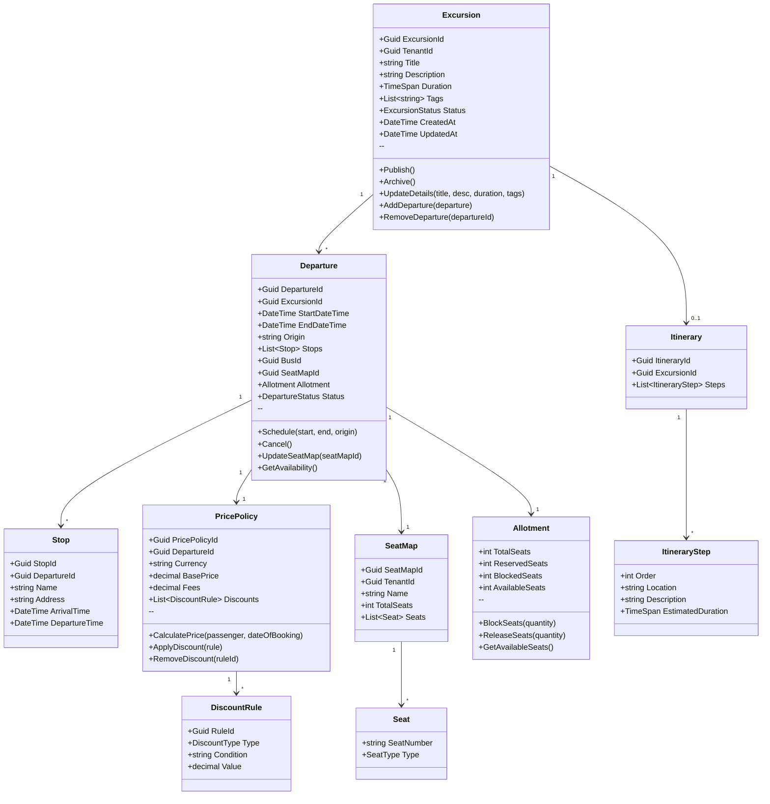

# Diagrama de Classes – Módulo Catalog

```mermaid
classDiagram
    class Excursion {
        +Guid ExcursionId
        +Guid TenantId
        +string Title
        +string Description
        +TimeSpan Duration
        +List~string~ Tags
        +ExcursionStatus Status
        +DateTime CreatedAt
        +DateTime UpdatedAt
        --
        +Publish()
        +Archive()
        +UpdateDetails(title, desc, duration, tags)
        +AddDeparture(departure)
        +RemoveDeparture(departureId)
    }

    class Departure {
        +Guid DepartureId
        +Guid ExcursionId
        +DateTime StartDateTime
        +DateTime EndDateTime
        +string Origin
        +List~Stop~ Stops
        +Guid BusId
        +Guid SeatMapId
        +Allotment Allotment
        +DepartureStatus Status
        --
        +Schedule(start, end, origin)
        +Cancel()
        +UpdateSeatMap(seatMapId)
        +GetAvailability()
    }

    class Stop {
        +Guid StopId
        +Guid DepartureId
        +string Name
        +string Address
        +DateTime ArrivalTime
        +DateTime DepartureTime
    }

    class Itinerary {
        +Guid ItineraryId
        +Guid ExcursionId
        +List~ItineraryStep~ Steps
    }

    class ItineraryStep {
        +int Order
        +string Location
        +string Description
        +TimeSpan EstimatedDuration
    }

    class PricePolicy {
        +Guid PricePolicyId
        +Guid DepartureId
        +string Currency
        +decimal BasePrice
        +decimal Fees
        +List~DiscountRule~ Discounts
        --
        +CalculatePrice(passenger, dateOfBooking)
        +ApplyDiscount(rule)
        +RemoveDiscount(ruleId)
    }

    class DiscountRule {
        +Guid RuleId
        +DiscountType Type
        +string Condition
        +decimal Value
    }

    class SeatMap {
        +Guid SeatMapId
        +Guid TenantId
        +string Name
        +int TotalSeats
        +List~Seat~ Seats
    }

    class Seat {
        +string SeatNumber
        +SeatType Type
    }

    class Allotment {
        +int TotalSeats
        +int ReservedSeats
        +int BlockedSeats
        +int AvailableSeats
        --
        +BlockSeats(quantity)
        +ReleaseSeats(quantity)
        +GetAvailableSeats()
    }

    %% Relationships
    Excursion "1" --> "*" Departure
    Excursion "1" --> "0..1" Itinerary
    Departure "1" --> "*" Stop
    Departure "1" --> "1" PricePolicy
    Departure "1" --> "1" SeatMap
    SeatMap "1" --> "*" Seat
    PricePolicy "1" --> "*" DiscountRule
    Departure "1" --> "1" Allotment
    Itinerary "1" --> "*" ItineraryStep
```
